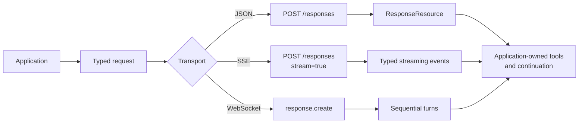

# OpenResponses Python SDK

A typed Python client for the [OpenResponses](https://github.com/openresponses/openresponses) protocol, pinned to the immutable **`2026-04-24`** wire contract.

The SDK provides sync and async HTTP clients, typed request/response models, SSE streaming, WebSocket turns, compaction, structured errors, and opaque provider-extension records.

## Install

```bash
python -m pip install openresponses-py
```

Python 3.10+ is required. The distribution is named `openresponses-py`; the Python import remains `openresponses`.

## First request

```python
from openresponses import OpenResponses

with OpenResponses(
    base_url="https://api.openai.com/v1",
    api_key="your-api-key",
) as client:
    response = client.responses.create({
        "model": "your-model",
        "input": "Give me one practical tip for testing an API.",
    })
    print(response.id)
```

Mappings are convenient for short calls. Use [`CreateResponseRequest`](protocol.md#requests-and-responses) for validated, IDE-friendly application boundaries.

## Choose a transport



| Need | Use |
| --- | --- |
| One JSON response | `responses.create(...)` |
| Incremental HTTP events | `stream=True` and `ResponseStream` |
| Persistent turns or continuation | `client.websocket()` |
| Long-context handoff | `responses.compact(...)` |

## Important boundaries

- The SDK validates the dated contract strictly by default. Use [`response_compatibility="openai-compatible"`](compatibility.md) only for documented partial provider shapes.
- The SDK does **not** execute tools or run an agent loop. Inspect `function_call` items, execute approved application code, then return `function_call_output`.
- The SDK does **not** automatically retry or reconnect. Response creation may execute or bill work, so retry policy belongs to the application.
- Unknown provider-prefixed records are preserved as opaque models; malformed records claiming a standard type are rejected.

## Explore the SDK

- [Quickstart](quickstart.md) — install, configure, JSON, async, and function-call continuation.
- [Protocol models](protocol.md) — items, tools, validation, serialization, and extensions.
- [SSE streaming](streaming.md) — typed event lifecycle, state validation, and cleanup.
- [WebSockets](websocket.md) — sequential turns, `store=False`, reconnect, and compaction handoff.
- [Provider compatibility](compatibility.md) — strict versus explicit OpenAI-compatible mode.
- [API reference](api.md) — the public surface and common import patterns.

The vendored schema is [`openresponses/openapi/2026-04-24.json`](https://github.com/openresponses/openresponses/blob/main/public/openapi/2026-04-24/openapi.json). Later protocol releases require an explicit SDK and conformance update.
