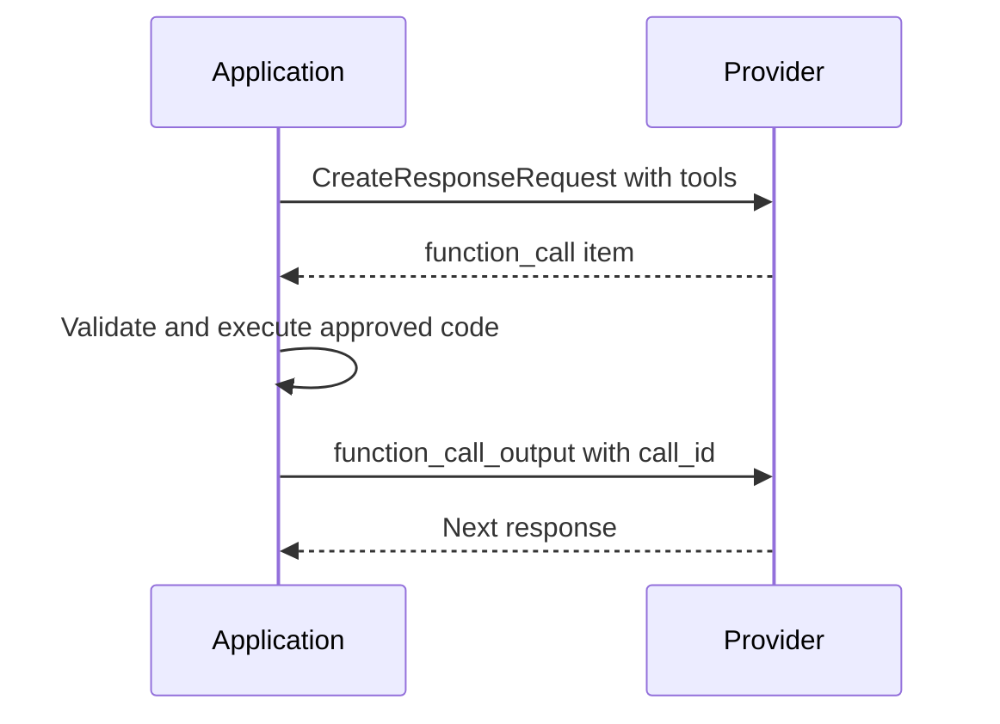

# Typed protocol models

The SDK's default contract is the OpenResponses release `2026-04-24`. The vendored schema is `openresponses/openapi/2026-04-24.json`; imports are re-exported from the package root.

## Requests and responses

`CreateResponseRequest` covers the released create body, including:

- model and input;
- `previous_response_id`, instructions, storage, and truncation;
- tools and tool choice;
- output text configuration;
- temperature, top-p, and penalties;
- streaming and stream options;
- background mode and execution limits;
- reasoning, safety/cache identifiers, metadata, and service tier.

A request may be a typed model or a mapping. Mappings are validated before any network call.

```python
from openresponses import CreateResponseRequest

request = CreateResponseRequest.model_validate({
    "model": "my-model",
    "input": "Hello",
    "max_output_tokens": 64,
})
wire = request.model_dump(mode="json", by_alias=True, exclude_none=True)
```

`model` is optional on the request type because a provider may supply it through other configuration. `ResponseResource` is the validated JSON result. `CompactResponseRequest` requires `model` and returns `CompactResource`.

Pydantic validation enforces released field constraints before sending, including output-token and tool-call minimums, metadata entry/key/value sizes, prompt-cache key size, and `top_logprobs` range. Providers can still reject an otherwise schema-valid value for policy or capability reasons.

## Inputs, content, and tools

Input can be a string or a list of typed items. Message items are discriminated by both `type` and `role`, which lets the same wire `type: "message"` resolve to user, system, developer, or assistant models. Text, image, file, and video content have released parameter models. Function-call and function-call-output items preserve their call IDs and argument/output payloads.

Tools are declarative descriptions sent to the provider. `FunctionToolParam`, tool-choice models, text format models, and reasoning configuration are public types. A tool declaration is not executable code and the SDK has no tool registry.

```python
from openresponses import FunctionToolParam

weather = FunctionToolParam(
    type="function",
    name="get_weather",
    description="Get current weather for a city",
    parameters={
        "type": "object",
        "properties": {"city": {"type": "string"}},
        "required": ["city"],
    },
)
```

## Function-call continuation



A function call is a protocol result, not an SDK-fulfilled action. To continue:

1. Declare tools in the create request.
2. Inspect `ResponseResource.output` for `function_call` items.
3. Dispatch only application-approved functions in your own code.
4. Submit a `function_call_output` item with the exact returned `call_id`.
5. Use `previous_response_id` only if the provider retained the response, or include the relevant items explicitly.

Do not claim that a tool ran merely because a function-call item was returned. Do not blindly evaluate model-produced arguments or invoke arbitrary provider-selected code.

## Serialization and extensions

All protocol models use an extra-field allow policy. Unknown provider fields survive validation and are emitted again by `model_dump(..., exclude_unset=False)`. Provider-prefixed item/event records can be represented as `UnknownItem` or `UnknownStreamingEvent`, retaining `type`, optional `sequence_number`, and extension payloads.

Malformed records that claim a known standard discriminator remain errors. The SDK does not reinterpret invalid standard events as opaque provider extensions.

## Compatibility boundary

Use `OPENRESPONSES_SPEC_VERSION` to inspect the pinned protocol version. The package does not silently follow an unreleased upstream `main` contract. A later release requires an explicit type/model and conformance update.
